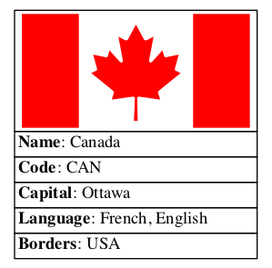

# Travail pratique 2
## Description
This program, written in C language, displays information of a country or of the
countries in a region, including the languages spoken, the capital city, the
neighbouring countries and the national flag.

The information is displayed as `text` on the standard output by default. The 
output format can be explicitly specifyed as `text`, `dot` (Graphviz) or `png`.
An output file can be specified for the `text` and `dot` formats but it is 
mandatory for the `png` format.

The project was produced in the course *Construction et maintenance de
logiciels*.

## Authors
- Michael Tessier
- Mathieu Loyer
- Julie Chao-Jung Wu

## Supported Plateforms
- Ubuntu 16.04 LTS: Fully supported.
- MALT server: Fully supported.
- MacOS X 10.9.5: Fully supported. 

## Dependencies
* `countries` project: A database containing lists of information of world
countries, originally from [GitHub](https://github.com/mledoze/countries), and
this program used the database forked from its
[derivative site](https://github.com/ablondin/countries) which `png` format for
the national flags was added to simplify the calling of Graphviz.

* `Graphviz` software: A graph visualization software, representing structural
information as diagrams of abstract graphs and networks. It supports the output
`dot` and `png` formats. [download here.](http://www.graphviz.org/)

* `Jansson` library: A C library that supports the manipulation of JSON data.
[download here.] (http://www.digip.org/jansson/)

* `bats` software: *Bash Automated Testing System*, provides a simple way to
verify that the UNIX programs you write behave as expected.
[download here.](https://github.com/sstephenson/bats)

## Installation
#### make
To generate an executable program, enter the command (after **$** sign) in the 
terminal:

    $ make

#### make data
To clone the `countries` project in your local directory, enter the command:

    $ make data

#### make test
To launch the automatic test software, enter the command:

    $ make test

#### make clean
To remove the files generated with the executable, enter the command:

    $ make clean

#### make cleantest
To remove the binary files generated in the test folder, enter the command:

    $ make cleantest

#### --help
To display the help message of tp2, after an executable program is generated, 
enter the command:

    $ bin/tp2 --help

Briefly, available options are as follows:

    $ bin/tp2 [--help] [--output-format FORMAT] [--output-filename FILENAME]
     [--show-languages] [--show-capital] [--show-borders] [--show-flag]
     [--country COUNTRY | --region REGION]

## Operation
This program uses `cca3` 3-lettre code for calling a country. For example, 
**can** for Canada and **fra** for France.

#### example input command for one country:
    $ bin/tp2 --country can --show-languages --show-capital --show-borders

output:

    Name: Canada
    Code: CAN
    Capital: Ottawa
    Languages: English, French
    Borders: USA

#### example input command for the countries in a region:
    $ bin/tp2 --region oceania --show-languages --show-capital --show-borders

output:

    Name: American Samoa
    Code: ASM
    Capital: Pago Pago
    Languages: English, Samoan
    Borders:
    Name: Australia
    Code: AUS
    Capital: Canberra
    Languages: English
    Borders:
    ...
    Name: Samoa
    Code: WSM
    Capital: Apia
    Languages: English, Samoan
    Borders:

####  display results in different output format options
**input command for `text` format** (default, or specified by
`--output-format text` flag):

Note that `--show-flag` option is not valid in this format

    $ bin/tp2 --country can

or

    $ bin/tp2 --country can --output-format text

standard output:

    Name: Canada
    Code: CAN

**input command for `dot` format of Graphviz** (`--output-format dot`):

    $ bin/tp2 --country can --show-languages --show-capital --show-borders \
      --show-flag --output-format dot

standard output:

    graph {
        can [
            shape = none,
            label = <<table border="0" cellspacing="0">
                <tr><td align="center" border="1" fixedsize="true" width="200" height="100">
                </td></tr>
                <tr><td align="left" border="1"><b>Name</b>: Canada</td></tr>
                <tr><td align="left" border="1"><b>Code</b>: CAN</td></tr>
                <tr><td align="left" border="1"><b>Capital</b>: Ottawa</td></tr>
                <tr><td align="left" border="1"><b>Language</b>: French, English</td></tr>
                <tr><td align="left" border="1"><b>Borders</b>: USA</td></tr>
            </table>>
        ];
    }

**input command for generating a file** in `dot` format
(`--output-format dot`, `--output-filename ...`):

**first step**:
Note that the filename extension is required and has to be **.dot**

    $ bin/tp2 --country can --show-languages --show-capital --show-borders \
      --show-flag --output-format dot --output-filename canada.dot

**second step**
(use `neato` function to further generate `png` file from `dot` file):  

    $ neato -Goverlap=false -Tpng -o canada.png canada.dot

**input command for generating a file** in `png` format
(`--output-format png`, `--output-filename ...`):
Note that the filename extension is required and has to be **.png**

    $ bin/tp2 --country can --output-format png --output-filename canada.png

output file image:

## Project Contents

**structure of the project**

    Makefile
    README.md
    bin/
        tp2
    data/
        countries/
            CONTRIBUTING.md
            LICENSE
            ...
            package.json
            src/
    src/
        countries.c
        countries.h
        ...
        tp2.c
    test/
        cmdtest.c
        test.bats
        ...

**contents**
* `tp2.c`: File containing the `main` function
* `getArgs.h`: File containing the structures and prototypes to register the user input commands
* `getArgs.c`: File containing the implementation of the functions to register the user input commands
* `countries.h`: File containing the structures and prototypes used to read countries.json
* `countries.c`: File containing the implementation of the functions used to
read countries.json
* `createdot.h`: File containing the structures, prototypes and documentations for `dot` and `png` output formats
* `createdot.c`: File containing the implementation of the functions for `dot`
and `png` output formats
* `displaytext.h`: File containing the prototypes and documentations for `text` output format
* `displaytext.c`: File containing the implementation of the functions for default `text` output format
* `tool.h`: File containing the prototypes and documentations of the common functions
* `tool.c`: File containing the implementation of the common functions, mainly the treatments of strings.
* `README.md`: Documentation of this project
* `Makefile`: Supports the calling of `make`, `make clean`, `make data`, `make test` and `make fun`
* `.gitignore`: Makes git ignore output files, `a.out` and `*.o` files while
updating git status
* `.gitlab-ci.yml`: Gitlab configuration for launching tests automatically
* `test.bats`: Tests automatically the exacutable with various scenarios
* `cmdtest.c`: Tests the exacutable with various scenarios in command line. This test only varifies if the command is executed with an output, but does not verify the contents of the output.
* `log_cmdtest_tp2output.txt`: Registers the results of `cmdtest` that would be displayed in standard output.

## References
1. Professor Alexandre Blondin Massé's lecture notes
2. [The skeleton of this project]
(https://gitlab.com/ablondin/inf3135-aut2016-tp2)
3. [HTML-Like Labels in Graphviz]
(http://www.graphviz.org/doc/info/shapes.html#html)
4. [Git Submodules: Adding, Using, Removing, Updating]
(https://chrisjean.com/git-submodules-adding-using-removing-and-updating/)
5. [Configuration of your builds with .gitlab-ci.yml]
(https://docs.gitlab.com/ce/ci/yaml/README.html)
6. [Exemple of a generic makefile]
(www.stackoverflow.com/questions/1484817/hot-to-make-a-simple-makefile-for-gcc-on-linux)
7. [Recursive use of make]
(https://www.gnu.org/software/make/manual/html_node/Recursion.html)

## Status
- [x] README
  - [x] Insert example figure (Mathieu)

- [x] Makefile
  - [x] Generic makefile (Michael)
  - [x] Non-flat makefile (Julie)
  - [x] Recursively call test/makefile for `make test` (Julie)

- [x] Read countries.json using the jansson librairy
  - [x] Reading of the JSON file using Jansson (Michael)
  - [x] Storage of the information in a strucure (Michael)
  - [x] debug malloc error (Michael)

- [x] Management of arguments with getopt.h
  - [x] Create files: `getArgs` `.c` and `.h` (Mathieu)
  - [x] Flags without arguments in getArgs
    - [x] `--help` prelim (Julie)
    - [x] `--help` final (Mathieu)
    - [x] `--show-language` (Mathieu)
    - [x] `--show-capital` (Mathieu)
    - [x] `--show-borders` (Mathieu)
    - [x] `--show-flag` (Mathieu)
  - [x] Flags with arguments in getArgs
    - [x] `--country <COUNTRY>` (Mathieu)
    - [x] `--region <REGION>` (Mathieu)
    - [x] `--output-format <FORMAT>` (Mathieu)
    - [x] `--output-filename <FILENAME>` (Mathieu)
  - [x] Erroneous flag combinations
    - [x] `--country <COUNTRY>` and `--region <REGION>` (Mathieu)
    - [x] `--show-flag` and `--output-format text` (includes default format) (Mathieu)
  - [x] Flags with arguments in main.c (Julie)
  - [x] Management of unkown arguments in getArgs (Mathieu)

- [x] Create outputs as `text`, `dot`, and `png`
  - [x] Generate `dot` strings as display in the standard output or in a file
  for **one country** (Julie)
  - [x] Generate `png` image showing national flag and other information for
  **one country** (Julie)
  - [x] Extend the above two tasks to a **region** of multiple countries
  (Julie)
  - [x] Generate `text` showing information on the standard output for
  **one country** and **region**  (Mathieu)
  - [x] Fix the above issue (Michael)
  - [x] Use actual user flags to manage output requests (Julie)

- [x] Test suite
  - [x] Scenarios to test (Julie)
  - [x] Implement basic tests in C: `make test` for `cmdtest` and `make fun`
  for `fun` (Julie)
  - [x] Implement a test suite in BATS that runs on git automatically (Michael)
  - [x] test7b does not run the free malloc lines 67-68. **BUG**: exit pre-maturely [^2]
        * this command does not initiate countries, so no need to free memory.
        * but it does allocate memory in getArgs.c => line 178 getArgs.c needs to free memory
  - [x] line 178 getArgs.c needs to free memory

[^2]: test7b command line:

    bin/tp2 --country fra --show-languages --show-capital --show-borders \
                 --show-flag --output-format png
